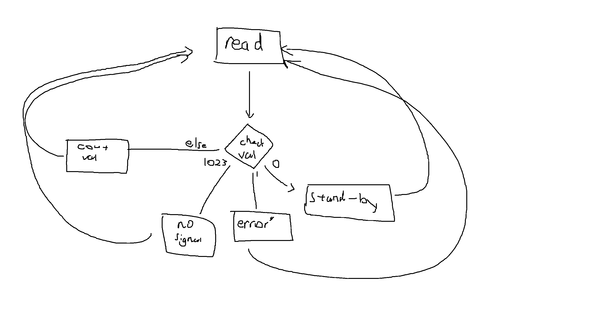

	


### Goal Setting

This section includes context on the goal, failed motor drivers which were used prior to the current chip, as well as a clear plan for the current goal.

##### Context

Specifically for this sprint, there were multiple angles that could have been tackled to improve the fine movement of the robot. 

As a group, we identified that improving the current bidirectional function of the motors was crucial. In previous years we had used a premade motor driver which was slow and inefficient. 


##### Failed Motor Drivers

To give context, in previous years we had used these two motor drivers:

###### **MD31B**

Specs

- 40V
- 21A

Pros

- Compact Form Factor
- Rarely short-circuits/burns up
- Modular
- Pin-Header, easy to mount on board
- Light

Cons:

- Connectors are really inconsistent
- Spread out among 4 drivers (*each motor requires one driver*)
- 40V and 21 Amp capacity not always usable

###### **RobotPower Multimoto Driver**

Specs

- 36V
- 6A (per channel)

Pros
- Space efficient
- 4-Channel 1-Board

Cons
- Short Circuits
- Draw lots of power
- Wires coming from the battery catch fire
- Built for Arduino Uno, fitting issues with the Mega limit pins

##### **Goal: Implement Custom Printed Motor Driver (BTN8962TA)**

Neither of these drivers were ideal for our robot design, so we (john) designed our own board using two BTN8962TA bridges on a PCB. 


To test this goal we will need:

- A quick and dirty circuit using the motor driver
- A working documented code
- Testing response times, voltages, and quality of chip.

### Research

This section includes background information regarding other potential methods to implement bi-directional control as well as research into both the implementation and testing methods.

##### Options

While John's PCB's were printing, I was researching other ways to potentially implemented bi-directional control. Two potential solutions were compiled:

1. Multiway (*DPDT*) Switches
2. Integrated Microcontroller-Driven H-Bridge

While DPDT switches are simpler and more cost effective, they offer both no rapid digital switching and no easy implementation with the Arduino Board.

Therefore, we have determined that using the H-Bridge circuit is more ideal.

##### Implementation

Documents which were read:

1. Datasheet: https://www.infineon.com/dgdl/Infineon-BTN8962TA-DS-v01_00-EN.pdf?fileId=db3a30433fa9412f013fbe2d247a7bf5

2. Wikipedia (reliable source!) for H-Bridge: https://www.wikiwand.com/en/H-bridge

3. John's PCB schematics

The data sheet in conjunction with the H-Bridge gave me some background information into how H-Bridges work (*which I was clueless about prior to this*) as well as details on how to implement the specific BTN8962TA chip.

To summarize the board schematics from earlier, the PCB has 4 pins that need to be connected

- INH or inhibit is an input pin which controls whether the board takes current. Typically since there are two bridges there are INH<sub>1</sub> and INH<sub>2</sub> pins but John wired them to be connected to one pin on the PCB, so these pins will be referred to as INH this point forward.
- IN1, which is the current flowing in the first H-Bridge (i*nput pin*)
- IN2, which is the current flowing through the second H-Bridge (*input pin*)
- IS which monitors current flow in the H-Bridges (*output pin*). Typically there are two analog IS pins (*one for each bridge*) but John wired them to connect to one pin on the PCB.

Note: While the BTN8962TA Bridge chip allows for PWM control, we opted out of doing so; only using the chip to control rotation by flipping the direction of current.


### Ideation

This section includes prototype code and wiring
##### Coding!


According to the Datasheet<sup>2</sup>, for Normal Mode writing (*switching directions*):
| INH | IN<sub>1</sub> | IN<sub>2</sub> |
|-----|------|------|
| 0   | X    | X<sup>C</sup>   |

Where X is any binary value 0 or 1 which indicates the direction that the motor should turn in. Setting INH (*Inhibit*) to 0 will allow the binary signal to enter.


> [INFO] Important Note!
> The IN<sub>2</sub> pin must be the complement to the IN<sub>1</sub> pin.
> E.g. IN<sub>1</sub> = 1, IN<sub>2</sub> = 0 


This information was found in the datasheet attached above on page 19.

[BT Datasheet.png](BT Datasheet.png)


Simple Pseudocode:

```
void setup() {
# Setup pins
}

void loop() {
	write to INH pin LOW
	write opposite values to pins to test spin direction
	delay
	write opposite values to pins to test spin direction
	delay
}

```

##### Wiring

Setup that will be used to test the code:


### Prototyping

##### Coding!

```CPP
#include <Arduino.h>

  

enum pins

{

  INH = 8,

  IN_1 = 9,

  IN_2 = 10,


};

  

class MotorControl

{

  

public:

  void rot()

  {

    digitalWrite(IN_1, HIGH);

    digitalWrite(IN_2, LOW);

  }

  

  void rotOpp()

  {

    digitalWrite(IN_1, LOW);

    digitalWrite(IN_2, HIGH);

  }

  

  void debugTest(long s)

  {

    rot();

    delay(s);

    rotOpp();

    delay(s);

  }

};

  

void setup()

{

  pinMode(INH, OUTPUT);

  pinMode(IN_1, OUTPUT);

  pinMode(IN_2, OUTPUT);

}

  

MotorControl MC;

  

void loop()

{

  digitalWrite(INH, LOW);

  MC.debugTest(10000);

  
}
```

The code above assumes that each of the pins are connected to their respective assigned value to the microcontroller.

##### Wiring

Here is the setup that will be used to test, note that the pins and battery aren't connected because its hard to take a picture by yourself and hold all the wires in due to my limited supply of hands.


### Testing and Critique

This section includes notes from the first test as well as my attempts to isolate the issue.

##### First Test

Running this code for the first time no resulting effect could be observed on the motor. Testing all potential values and combinations for IN<sub>1</sub> and IN<sub>2</sub> did not return anything particularly useful either.

##### Debugging!


**Code?**
We tested a standardized library too with no success: https://github.com/Infineon/DC-Motor-Control-BTN8982TA 

**Wiring?**
All wiring was double checked, pins were checked too, wires and batteries were both switched incase errors occurred there.


**Chip?**
The PCB was tested using a multimeter, testing the difference between V<sub>Supply</sub> and V<sub>Ground</sub> returned 12V, meaning that V<sub>Out</sub> was 0V. 

These results suggest that either something went wrong with the motor driver or the bridge chip is failing to work properly

##### Testin'

Just to 100% make sure that the code and logic was fine, I tested the code on the previous md31b driver which worked perfectly fine :o(


##### Takeaways

Since I've tested everything and almost certified with 100% confirmation that the problem is most likely in the PCB and the bridge itself, there not much that could really be done in terms of improvements.

However, when I was debugging the code I noticed that I never implemented the IS pin.

The IS pin monitors the current flow in the two bridge chips. Here is the code that incorporates the debug pin.

```CPP
#include <Arduino.h>

  

enum pins

{

  INH = 8,

  IN_1 = 9,

  IN_2 = 10,

  IS = A0

};

  

class MotorControl

{

  

public:

  void rot()

  {

    digitalWrite(IN_1, HIGH);

    digitalWrite(IN_2, LOW);

  }

  

  void rotOpp()

  {

    digitalWrite(IN_1, LOW);

    digitalWrite(IN_2, HIGH);

  }

  

  void debugTest(long s)

  {

    rot();

    delay(s);

    rotOpp();

    delay(s);

  }

};

  

void setup()

{

  Serial.begin(9600);

  pinMode(INH, OUTPUT);

  pinMode(IN_1, OUTPUT);

  pinMode(IN_2, OUTPUT);

  pinMode(IS, INPUT);

}

  

MotorControl MC;

  

void loop()

{

  digitalWrite(INH, LOW);

  MC.debugTest(10000);

  

  int signal;

  

  signal = analogRead(IS);

  

  switch (signal)

  {

    case 0:

      Serial.println("Signal: 0, on stand-by");

      break;

    case 1:

      Serial.println("Signal: 1, error");

      break;

    case 1023: // Standard if IS read DNE

      Serial.println("No signal received");

      break;

    default:

      Serial.print("Signal Received: ");

      Serial.println(signal);

      break;

  }

}

```

Specifically, this snippet is the new piece of code:
```CPP
  {

    case 0:

      Serial.println("Signal: 0, on stand-by");

      break;

    case 1:

      Serial.println("Signal: 1, error");

      break;

    case 1023: // Standard if IS read DNE

      Serial.println("No signal received");

      break;

    default:

      Serial.print("Signal Received: ");

      Serial.println(signal);

      break;

  }
```

The code logic is as follows:

For implementing the IS pin, the specific outputs and what they correspond to would be useful to implement properly within the code.

| IS Return Value  | Definition (Code Return Value) |
|------------------|--------------------------------|
| 0                | Stand-By                       |
| 1                | Short-Circuit Error            |
| 1023             | No-Signal Received             |
| All other values | Return IS Value                |




Note that error or an analogRead() value of 1 refers to short current spikes<sup>(1, 16)</sup>.
### Final Design

Final Code:

```CPP
#include <Arduino.h> //Used for VSCode, if using Arduino IDE remove.


// Enumerated pins, same thing as #define but with type error checking
enum pins
{
  INH = 8,
  IN_1 = 9,
  IN_2 = 10,
  IS = 11
};


// Class to organize
class MotorControl
{

public: // Allows other classes to access
  void rot()
  {
    // Alternate IN_1 and IN_2
    digitalWrite(IN_1, HIGH);
    digitalWrite(IN_2, LOW);
  }

  void rotOpp()
  {
    // Alternate IN_1 and IN_2
    digitalWrite(IN_1, LOW);
    digitalWrite(IN_2, HIGH);
  }

  void debugTest(long s)
  {

    rot();
    delay(s);
    rotOpp();
    delay(s);
  }
};

void setup()
{
  Serial.begin(9600);
  pinMode(INH, OUTPUT);
  pinMode(IN_1, OUTPUT);
  pinMode(IN_2, OUTPUT);
  pinMode(IS, INPUT);
}

MotorControl MC;

void loop()
{
    // Writes low to the inhibit gate
  digitalWrite(INH, LOW);
  //Switch every 10 seconds
  MC.debugTest(10000);

  int signal;

  signal = analogRead(IS);


    // See repo for more detail
  switch (signal)
  {
    case 0:
      Serial.println("Signal: 0, on stand-by");
      break;
    case 1:
      Serial.println("Signal: 1, error");
      break;
    case 1023: // Standard if IS read DNE
      Serial.println("No signal received");
      break;
    default:
      Serial.print("Signal Received: ");
      Serial.println(signal);
      break;
  }
}

```

Circuit Diagram:


### Conclusion

While this Sprint was not successful (*yet*), there are some important takeaways. The research section offers extremely insightful background information into the BTN8962TA chip as well as its implementation. I also learned about common debugging methods and how to read schematics during this.

To any other engineering students this sprint can be extremely helpful as a starting point in implementing your own H-Bridge controlled motor driver, using my summarized documentation to quickly understand the details of the circuitry.

*I heard from other teams that the BTN8962TA is kind of bad though so maybe don't use it if you are making your own*.
